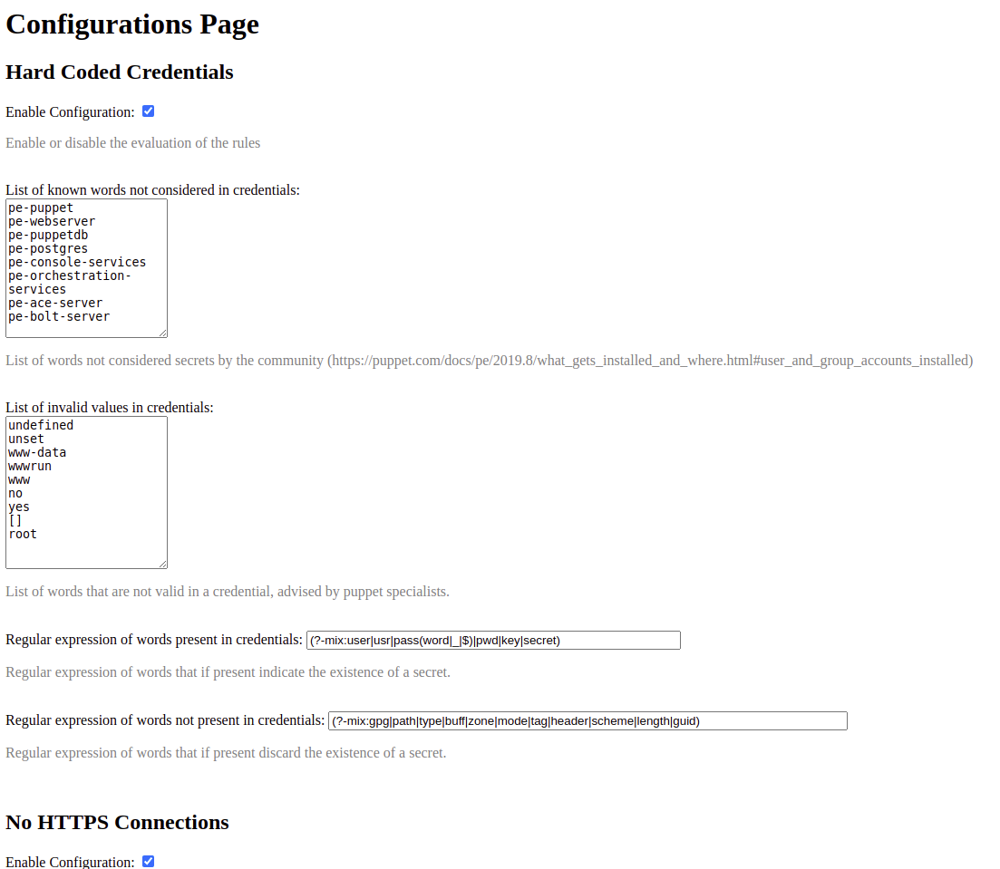

# Puppet Security Linter

Puppet linter focused on finding security vulnerabilities in code.


## Installation

Install the Ruby gem:

```bash
gem install puppet-sec-lint
```
## Usage

To analyze a puppet file, simply call the newly installed linter:

```bash
puppet-sec-lint /folder/script.pp
```

If the linter is called with a folder, all puppet files inside are recursively analyzed:

```bash
puppet-sec-lint /folder
```

### Integration with Visual Studio Code

The linter can also work inside Visual Studio code. For it, please ensure that the 'puppet-sec-lint' gem was installed on your system.

Then, install the [puppet-sec-lint VSCode extension](https://marketplace.visualstudio.com/items?itemName=tiago1998.puppet-sec-lint-vscode).

Now, after that the extension is activate, it should be activated automatically when a Puppet file is opened, analyzing and displaying warnings in real time.


###Customization of Linter Rules

All rules applied by the linter to detect vulnerabilities can be configured to better adapt the tool to any project conventions and requirements.

To open the configurations page, use the appropriate flag:

```bash
puppet-sec-lint -c
```
(this will open the configurations page on the computer default web browser)



## Development

### Development of new rules

The linter was built on top of a modular architecture, which means that new customizable rules can be added fairly easy facing the discovery of new scenarios and vulnerabilities.

<!--
(add instructions on how to clone, build and run tool)

(add instructions on where and how to add new rule and configurations)
-->

<!--After checking out the repo, run `bin/setup` to install dependencies. Then, run `rake test` to run the tests. You can also run `bin/console` for an interactive prompt that will allow you to experiment.

To install this gem onto your local machine, run `bundle exec rake install`. To release a new version, update the version number in `version.rb`, and then run `bundle exec rake release`, which will create a git tag for the version, push git commits and the created tag, and push the `.gem` file to [rubygems.org](https://rubygems.org).-->


## Contributing

<!-- Bug reports and pull requests are welcome on GitHub at https://github.com/[USERNAME]/puppet-sec-lint. This project is intended to be a safe, welcoming space for collaboration, and contributors are expected to adhere to the [code of conduct](https://github.com/[USERNAME]/puppet-sec-lint/blob/master/CODE_OF_CONDUCT.md). -->

## License

<!-- The gem is available as open source under the terms of the [MIT License](https://opensource.org/licenses/MIT).-->

## Code of Conduct

<!-- Everyone interacting in the Puppet::Sec::Lint project's codebases, issue trackers, chat rooms and mailing lists is expected to follow the [code of conduct](https://github.com/[USERNAME]/puppet-sec-lint/blob/master/CODE_OF_CONDUCT.md).-->
