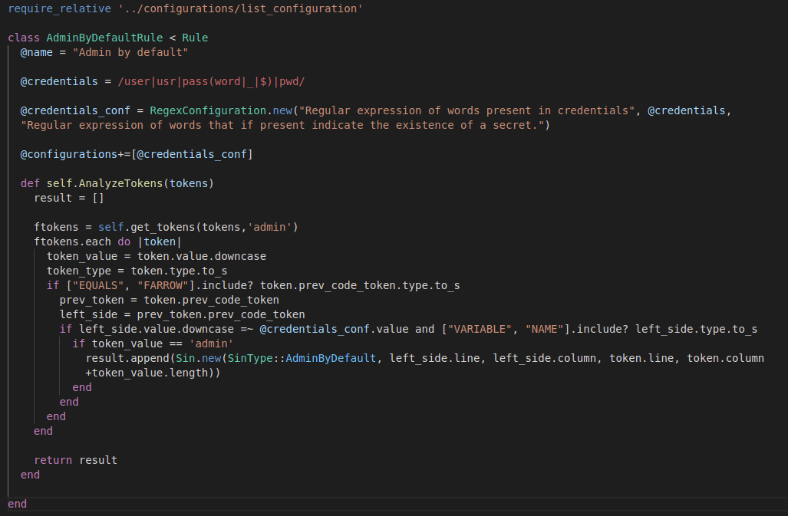
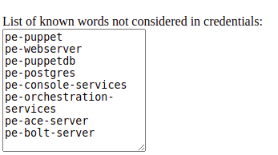

# Puppet Security Linter

Puppet linter focused on finding security vulnerabilities in code.


## Installation

Install the Ruby gem:

```bash
gem install puppet-sec-lint
```
## Usage

To analyze a puppet file, simply call the newly installed linter:

```bash
puppet-sec-lint /folder/script.pp
```

If the linter is called with a folder, all puppet files inside are recursively analyzed:

```bash
puppet-sec-lint /folder
```

### Integration with Visual Studio Code

The linter can also work inside Visual Studio code. For it, please ensure that the 'puppet-sec-lint' gem was installed on your system.

Then, install the [puppet-sec-lint VSCode extension](https://marketplace.visualstudio.com/items?itemName=tiago1998.puppet-sec-lint-vscode).

Now, after that the extension is activate, it should be activated automatically when a Puppet file is opened, analyzing and displaying warnings in real time.


###Customization of Linter Rules

All rules applied by the linter to detect vulnerabilities can be configured to better adapt the tool to any project conventions and requirements.

To open the configurations page, use the appropriate flag:

```bash
puppet-sec-lint -c
```
(this will open the configurations page on the computer default web browser)


## Development

The linter was built on top of a modular architecture, which means that new customizable rules can be added fairly easy facing the discovery of new scenarios and vulnerabilities.

### Cloning and running 

To add new functionality to the tool, start by cloning the repository into a folder.
To run the software locally, run the executable **exe/puppet-sec-lint** from a command line.

### Adding new rules

To add a new rule, the easiest way is to duplicate the file of an existing rule inside the **lib/rules** folder. Taking the *Admin By Default* rule as an example, here is everything that can be changed and customized.



#### Naming

The class should have an unique and meaningful name, both at the class name itself and the property @Name (that's what's displayed in the Configurations page). It should also be derived from the **Rule** class.

#### Token analysis

Each rule works by running the **AnalyzeTokens** method, receiving a list of tokens (that represent the entire code of the file being analyzed) and after analyzing everything, it should return a list of results (each result is a vulnerability found represented by the **Sin** class). Adding new types of vulnerabilities can be done by adding new elements to the **SinType** class.

#### Configurations

To add configurable elements to the class, simply create new instances of the child classes of the **Configuration** class, as exemplified in the above rule. The constructor takes as arguments the title and description (to be shown in the configurations page) and the initial default value (before the user modifies the application settings).

All configurations should then be added to the @configurations array.

The current types of configurations available (children of the **Configuration** class) are:

* Boolean
  
  
* List of elements
  
  
* Regular Expression
  
  

#### Add rule to rule engine

The final step is to ensure that the Rule Engine can detect and run the rule everytime an analysis is performed. As such, in the **lib/rule_engine.rb** file, import the newly created rule and add it to the @rules array.

---

After following these steps, the rule should then be automatically run everytime an analysis is performed. Also, the configurations now show up automatically in the configurations page, giving the user the possibility to customize its values. 

## Contributing

<!-- Bug reports and pull requests are welcome on GitHub at https://github.com/[USERNAME]/puppet-sec-lint. This project is intended to be a safe, welcoming space for collaboration, and contributors are expected to adhere to the [code of conduct](https://github.com/[USERNAME]/puppet-sec-lint/blob/master/CODE_OF_CONDUCT.md). -->

## License

<!-- The gem is available as open source under the terms of the [MIT License](https://opensource.org/licenses/MIT).-->

## Code of Conduct

<!-- Everyone interacting in the Puppet::Sec::Lint project's codebases, issue trackers, chat rooms and mailing lists is expected to follow the [code of conduct](https://github.com/[USERNAME]/puppet-sec-lint/blob/master/CODE_OF_CONDUCT.md).-->

## Release Notes

### 1.0.0

Initial release. It supports analysis of Puppet manifests and user configuration of rules.